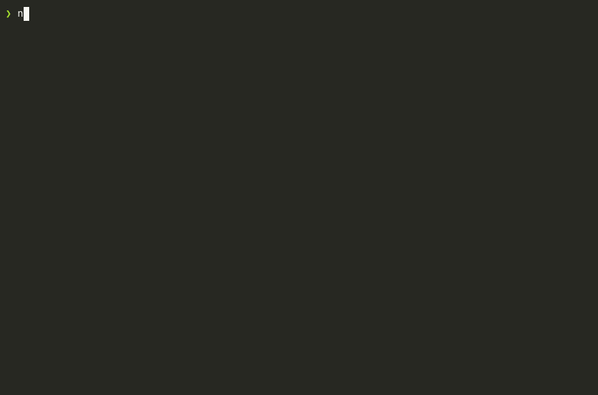

# NetRain 🌧️

```
╔╗╔═╗╔╦╗╦═╗╔═╗╦╔╗╔
║║║╣  ║ ╠╦╝╠═╣║║║║
╝╚╚═╝ ╩ ╩╚═╩ ╩╩╝╚╝
```

> *"Welcome to the real world."* - Morpheus

A **Matrix-style network packet monitor** for the terminal: live capture or pcap replay, protocol and hostname insight, flows, and scan/flood detection, with a JSON mode for scripts. Written in Rust.

⚡ **Quick Start**: Install Rust → `cargo install netrain` → `sudo netrain` (or `netrain --demo`)

[](https://crates.io/crates/netrain)
[](https://opensource.org/licenses/MIT)
[](https://crates.io/crates/netrain)
[](https://github.com/marcuspat/netrain/stargazers)

## 🎬 Demo



*Demo mode (`netrain --demo`) — no root or live interface needed. Recorded from the binary with [asciinema](https://asciinema.org) + [agg](https://github.com/asciinema/agg). The recording predates the current layout (flows, top talkers, alert details, help overlay).*

## ⚡ Performance

Benchmarks of netrain's own code on in-memory packets (2 vCPU Xeon @ 2.10GHz, one thread);
they exclude libpcap, the kernel and terminal rendering:

- **Decode**: 20 ns per packet. **Decode, classify and extract hostnames**: 89 ns per packet.
- **Full path to the UI state** (statistics, flows, threat engine, log line): about 1 M packets/s.
- **Under attack**: the threat engine handles a SYN flood from 20,000 spoofed sources at
  1.2 M packets/s, and a single-source port scan at 1.8 M packets/s.
- **Bounded memory**: every table is capped; the demo runs at about 10 MB.

Method, numbers and what is not measured: [docs/PERFORMANCE.md](docs/PERFORMANCE.md).

## ✨ Features

### 🛡️ Threat detection
- **Port scans** (many ports on one host) and **host sweeps** (one port across many hosts)
- **Stealth scans** using NULL, FIN-only or Xmas TCP flags
- **SYN floods**, judged by unanswered connection attempts so a busy server that replies is not flagged
- **Traffic spikes**
- Alerts name the source, the target and the evidence, and clear 30 seconds after the behaviour stops
- Default thresholds: 20 ports or hosts in 60 s, 100 unanswered SYNs in 10 s, 1000 packets/s

### 📊 Network analysis
- **Decoding**: Ethernet (with VLAN tags), raw IP, loopback and Linux cooked captures; IPv4 and IPv6; TCP, UDP, ICMP
- **Protocols**: TCP, UDP, HTTP, HTTPS, DNS, SSH, ICMP, QUIC, NTP, DHCP, mDNS, SSDP
- **Hostnames** from DNS queries, TLS server names (SNI) and HTTP `Host` headers
- **Passive name cache**: DNS answers seen on the wire label addresses; netrain never does lookups itself
- **Flows**: per-connection packets and bytes in each direction, with TCP state
- **Top talkers** ranked by bytes
- **Drop counter**: packets lost in the kernel, the interface or netrain's own queue

### 🖥️ Interface
- Matrix rain driven by packet arrivals
- Packet log with protocol filter and pause
- Protocol counts and sparklines for the busiest protocols
- Hex dump of the latest packet
- Help overlay, resize handling, and a clear message when the terminal is too small

### 🔧 Modes
- **Live capture**, **pcap replay** (`--read`), and **demo** (`--demo`, synthetic traffic)
- **Headless**: `--json` (newline-delimited JSON) or `--headless` (plain text), for pipes and servers
- **Summary**: `--read FILE --summary` prints what a capture contained and exits

### Limits worth knowing
- No TCP stream reassembly: a TLS handshake split across segments yields no server name.
- Detection thresholds are fixed defaults, not yet configurable from the command line.
- Encrypted payloads are not inspected; classification uses ports, flags and the first bytes.
- Linux and macOS are tested in CI. Windows is untested.

## 🚀 Installation

### From crates.io (Recommended)

**Requirements**: Rust 1.88+ must be installed first

```bash
cargo install netrain
```

### From Source

**Requirements**: Rust 1.88+ must be installed first

```bash
# Clone the repository
git clone https://github.com/marcuspat/netrain.git
cd netrain

# Build the project
cargo build --release

# The binary will be at ./target/release/netrain
```

## 📋 Prerequisites

### Install Rust (Required)

NetRain requires Rust 1.88+ for both installation methods above.

```bash
# Install Rust via rustup (recommended)
curl --proto '=https' --tlsv1.2 -sSf https://sh.rustup.rs | sh
source ~/.cargo/env

# Verify installation
rustc --version
cargo --version
```

Alternatively, visit [rustup.rs](https://rustup.rs/) for other installation options.

### Install libpcap (For packet capture)

#### Ubuntu/Debian
```bash
sudo apt-get update
sudo apt-get install libpcap-dev
```

#### macOS
```bash
# libpcap is included with macOS
# No additional installation needed
```

#### Windows
```bash
# Install WinPcap or Npcap
# Download from: https://npcap.com/
```


## 🎯 Usage

```bash
sudo netrain                              # live capture on the default interface
sudo netrain -i eth0 -f "tcp port 443"    # choose interface and BPF filter
netrain --list-interfaces                 # what can be captured on
netrain --demo                            # synthetic traffic, no privileges

netrain --read trace.pcap                 # replay a capture in the UI
netrain --read trace.pcap --summary       # print a summary and exit
netrain --read trace.pcap --json          # one JSON object per packet and alert

sudo netrain --json --alerts-only         # alerts and a final summary, for log shippers
sudo netrain --headless --count 1000      # plain text, stop after 1000 packets
```

`netrain --help` lists every option. JSON schema: [docs/JSON_OUTPUT.md](docs/JSON_OUTPUT.md).

### Keyboard Controls
| key | action |
|---|---|
| `q` | quit |
| `space` / `p` | pause the packet log and hex dump (analysis keeps running) |
| `f` | filter the log by protocol, cycling through those seen |
| `a` | show all protocols |
| `?` / `h` | help |
| `esc` | close help, or clear the filter |

### Understanding the Interface

- **Top bar**: version, capture source, FPS, packets per second, threat level.
- **Rain** (top left): a column falls for each packet; the border turns red while an alert is active.
- **Packet log** (left): top talkers by bytes, the heaviest flows, then one line per packet,
  for example `[12:00:01] HTTPS 10.0.0.2 -> 93.184.216.34 [134B] sni=example.com`.
- **Sparklines** (bottom left): activity of the six busiest protocols.
- **Right column**: performance (FPS, packets/s, memory, drops), protocol counts, threat
  monitor with up to three alert details, and a hex dump of the latest packet.

### Privileges

Live capture needs permission to open the interface. netrain drops root as soon as the capture
is open, so packets are parsed unprivileged, and it can run without `sudo` at all:

```bash
sudo setcap cap_net_raw,cap_net_admin+eip "$(command -v netrain)"
```

Promiscuous mode is off by default (`--promiscuous` to enable). Details: [docs/PRIVILEGES.md](docs/PRIVILEGES.md).

## 🧪 Development

```bash
cargo test                                   # unit, golden, binary and fuzz-smoke tests
cargo clippy --all-targets -- -D warnings
cargo fmt --all --check
cargo bench --bench pipeline                 # the real packet path
NETRAIN_FUZZ_ITERS=2000000 cargo test --test fuzz_smoke
```

Tests need no root and no network. One test captures on loopback and runs only as root.
CI runs all of the above on Linux and macOS, plus `cargo-deny`.

## 📈 Technical Architecture

```
capture thread                        UI thread
pcap -> decode -> classify ----------> state: stats, flows, names,
        (zero-copy)   inspect   bounded        threat engine, log
                                channel  ----> ratatui
```

- **One decode path** for live capture, replay, headless output and tests.
- **No locks on the packet path**: the capture thread sends small records over a bounded
  channel; when the UI cannot keep up, records are dropped and counted.
- **Everything is bounded**: host tables, flows, alerts, names and the log all have caps.
- **Untrusted input**: the library forbids `unsafe`; parsers are bounds-checked,
  property-tested and fuzzed; hostnames are validated before display.
- **Least privilege**: root is dropped once the capture is open.

More: [docs/ARCHITECTURE.md](docs/ARCHITECTURE.md), [docs/PERFORMANCE.md](docs/PERFORMANCE.md),
[docs/PRIVILEGES.md](docs/PRIVILEGES.md).

## 🤝 Contributing

We welcome contributions!

### Development Setup
```bash
# Fork the repo and clone your fork
git clone https://github.com/yourusername/netrain.git
cd netrain

# Create a feature branch
git checkout -b feature/amazing-feature

# Make your changes and test
cargo test
cargo clippy
cargo fmt

# Commit and push
git commit -m "feat: add amazing feature"
git push origin feature/amazing-feature
```

## 📋 System Requirements

- **OS**: Linux or macOS (tested in CI). Windows with Npcap may build but is untested.
- **Rust**: 1.88 or newer, and libpcap headers (`libpcap-dev` on Debian/Ubuntu).
- **Terminal**: at least 80x24, Unicode and 256 colours recommended. Not needed for
  `--json`, `--headless` or `--summary`.
- **Privileges**: permission to capture for live mode (see Privileges above); none for
  `--demo` and `--read`.
- **Memory**: about 10 MB resident in the demo.

## 🐛 Troubleshooting

### Common Issues

#### "cargo: command not found"
```bash
# Install Rust first (includes cargo)
curl --proto '=https' --tlsv1.2 -sSf https://sh.rustup.rs | sh
source ~/.cargo/env

# Verify installation
cargo --version
```

#### "Cannot capture on ..."
```bash
# Capturing needs permission. Either:
sudo netrain
# or grant the binary the capability once (Linux):
sudo setcap cap_net_raw,cap_net_admin+eip "$(command -v netrain)"
# or use a mode that needs none:
netrain --demo
netrain --read trace.pcap
```

#### Wrong or no interface
```bash
netrain --list-interfaces      # the default is marked with *
sudo netrain -i eth0
```

#### Nothing from other machines shows up
Promiscuous mode is off by default. Add `--promiscuous` to see traffic not addressed to
this host (on a shared segment or mirror port).

#### Terminal Display Issues
```bash
# Ensure terminal supports Unicode
export LANG=en_US.UTF-8

# For best experience, use a modern terminal like:
# - Alacritty, Kitty, WezTerm (recommended)
# - iTerm2 (macOS), Windows Terminal (Windows)
```

#### "Killed" Error During Installation (Linux)
If you get a "signal: 9, SIGKILL: kill" error when running `cargo install netrain` on Linux, your system likely doesn't have enough memory to compile the dependencies.

**Common on**: VPS/cloud instances with ≤1GB RAM

**Solution 1: Add Swap Space (Recommended)**
```bash
# Create a 4GB swap file
sudo fallocate -l 4G /swapfile
sudo chmod 600 /swapfile
sudo mkswap /swapfile
sudo swapon /swapfile

# Make it permanent
echo '/swapfile none swap sw 0 0' | sudo tee -a /etc/fstab

# Now try installing again
cargo install netrain
```

**Solution 2: Reduce Compilation Parallelism**
```bash
# Limit cargo to 1 job to reduce memory usage
export CARGO_BUILD_JOBS=1
cargo install netrain
```

**Solution 3: Use a pre-built binary**

Releases that carry binaries list them at https://github.com/marcuspat/netrain/releases as
`netrain-vX.Y.Z-<target>.tar.gz` with a `.sha256` file beside each. Verify the checksum,
unpack, and move `netrain` onto your `PATH`. Not every release has binaries.

## 📝 License

This project is licensed under the MIT License - see the [LICENSE](LICENSE) file for details.

## 🙏 Acknowledgments

- **The Matrix** franchise for inspiration
- **Rust community** for amazing performance tools
- **ratatui** for the terminal UI framework
- **pcap** library maintainers
- All the **security researchers** who make threat detection possible

## 📞 Support

- 🐛 **Bug Reports**: [GitHub Issues](https://github.com/marcuspat/netrain/issues)
- 💡 **Feature Requests**: [GitHub Issues](https://github.com/marcuspat/netrain/issues)

---

<div align="center">

**"There is no spoon... only packets."** 🥄

*Built with ❤️ in Rust*

[⭐ Star on GitHub](https://github.com/marcuspat/netrain) | [🍴 Fork](https://github.com/marcuspat/netrain/fork) | [📋 Issues](https://github.com/marcuspat/netrain/issues)

</div>

## Ecosystem

| Repo | What it does |
|------|-------------|
| [**secret-scan**](https://github.com/adventurewave-labs/secret-scan) | Rust secret scanner — obfuscation detection |
| [**codescope**](https://github.com/adventurewave-labs/codescope) | Rust code-intelligence engine for AI agents — no cloud, no DB |
| [**Sentinel**](https://github.com/marcuspat/Sentinel) | Deny-by-default agentic sysadmin: Investigate → Plan → Approve → Act |
| [**turbo-flow**](https://github.com/marcuspat/turbo-flow) | Agentic dev environment — 60+ AI subagents, Ruflo orchestration |
